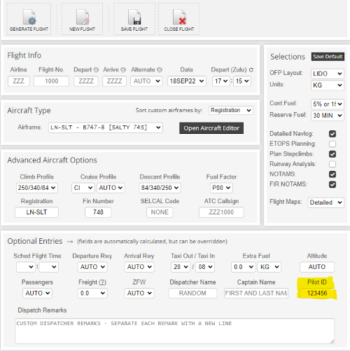
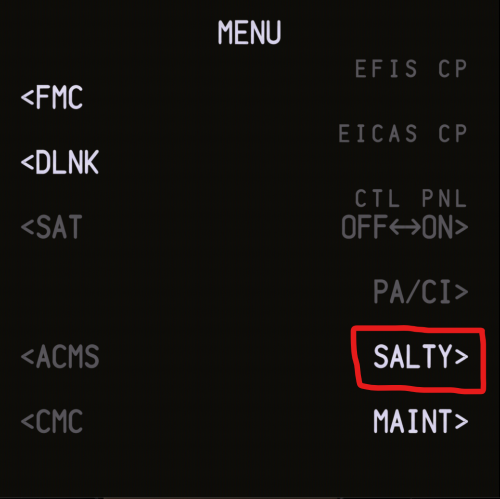
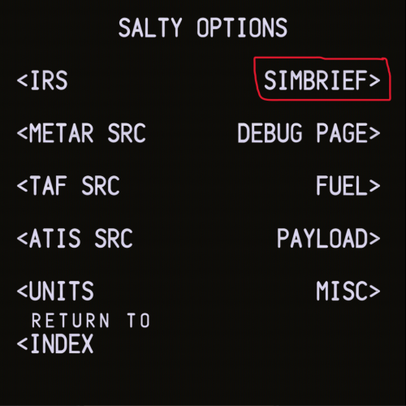
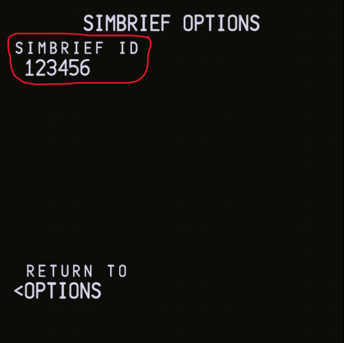
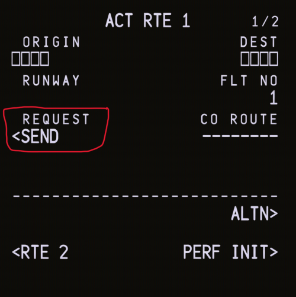
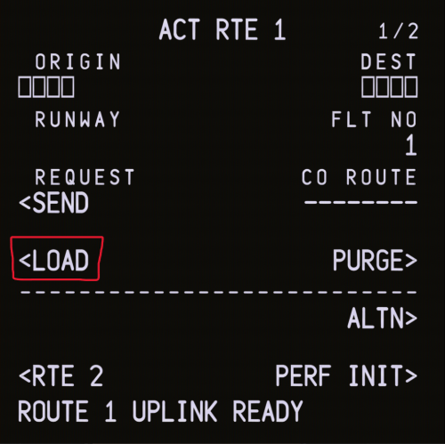
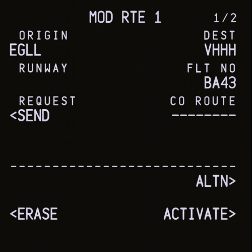

# SimBrief

:::note Video
This guide is also available in [video form](https://youtu.be/cSY-r83pXio) on our YouTube channel.
:::

:::info
This guide assumes you already have a Navigraph account and know how to set up a SimBrief flight plan. If you do not, our [video](https://youtu.be/cSY-r83pXio) covers this in detail.
:::

## Finding Your User ID
Before you can start importing your SimBrief flight plans into the aircraft, you must first know what your Simbrief User ID is. This allows the aircraft, and your flightplan, to seemlessly synchronise with each other. 

This six-digit ID can be found beneath your specified cruising altitude **BEFORE** generating your flight, as shown below:

## Intergrating SimBrief in the aircraft
Now that you know your Simbrief User ID, you can now use this to intergrate Simbrief with the Salty 747. 

From the `MENU` page in the FMC, navigate to the `SALTY` page by clicking on the corresponding LSK. 

Next, navigate to the `SIMBRIEF` page by clicking on the corresponding LSK

Finally, enter your Simbrief User ID (as found earlier in this section) by inputting the six-digit number using the keypad.

## Importing a Flightplan
Finally, you can import your Simbrief flightplan into the aircraft!

:::info
For this section I am using a Simbrief flightplan from EGLL to VHHH.
:::

Firstly, navigate to the route page using the keypad keys beneath the FMC.

Then, click on `ROUTE REQUEST` to draw your Simbrief flightplan into the aircraft

Wait a moment for the flightplan to be loaded, and you will be greeted with the option to `LOAD` the flightplan. I would advise clicking on the `LEGS` keypad key beneath the FMC and use the Next Page function to check for errors. If there are no errors, click `LOAD` as shown below.

Once this is complete, you will be greeted with a screen like this:

If you are happy, click on the green-illuminated `EXEC` button beneath the FMC to confirm the import.